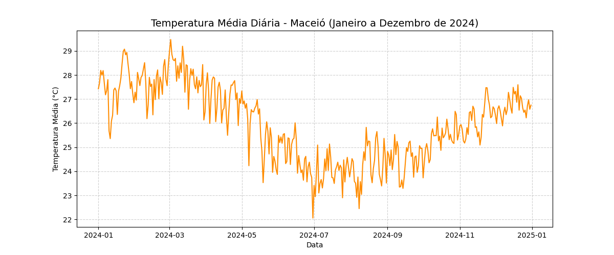

# Análise de Temperatura Média - Maceió (2024)

Este é um projeto prático de análise de dados meteorológicos onde investigo o comportamento da temperatura na minha cidade, Maceió, ao longo de 2024. 

A ideia foi pegar a base de dados pública da estação automática do INMET (Instituto Nacional de Meteorologia), que costuma vir com erros de formatação e sensores falhos, e construir um script em Python para tratar isso.

O código faz basicamente três coisas:
- Lê o arquivo `.csv` original e corrige problemas de formatação.
- Identifica e remove as falhas de leitura dos sensores (que o INMET registra como `-9999`).
- Agrupa as leituras horárias para calcular a temperatura média exata de cada dia.

O resultado de todo esse tratamento é o gráfico abaixo, mostrando a curva climática real da cidade durante o ano.

**Ferramentas que usei:** Python, Pandas (limpeza), Numpy e Matplotlib (geração do gráfico).

---

